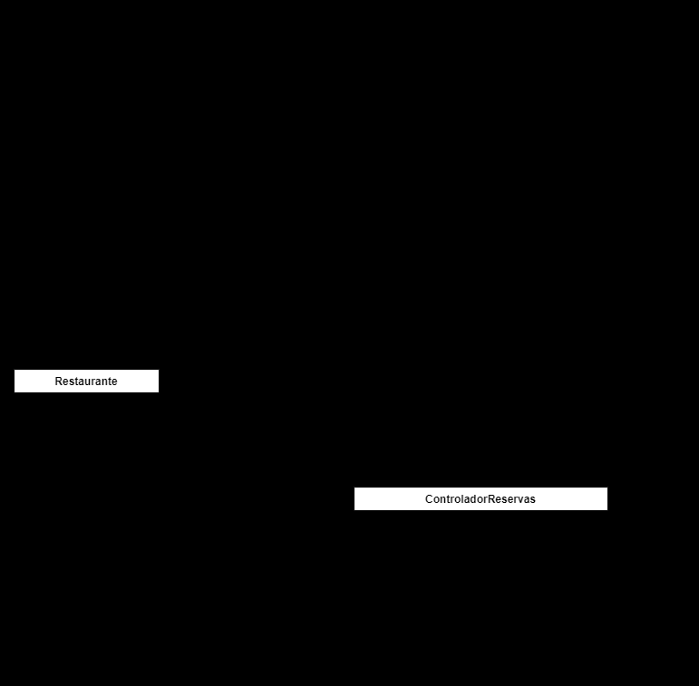

#Sistema de Reservas de Restaurante
Este es un programa básico en Python para manejar reservas en un restaurante. El programa cuenta con las siguientes funcionalidades:

Registro de usuarios: el sistema solicita al usuario su información de contacto (nombre, número y correo) para poder realizar la reserva y confirmar la reserva.

- Número de comensales: el sistema le indica al usuario cuántos comensales van a la reservación.

- Fecha y hora: el sistema permite seleccionar fecha y hora para la reserva.

- Disponibilidad: el sistema le muestra la capacidad y si es posible realizar o no la reserva.

##Requerimientos
Python 3.x

##Cómo usar
1. Clonar el repositorio o descargar el archivo ZIP.

2. Abrir una terminal y navegar a la carpeta del repositorio descargado.

3. Ejecutar el comando python main.py.

4. Seguir las instrucciones en pantalla para hacer una reserva.

##Funcionamiento
El programa mantiene una lista de reservas realizadas, que se almacena en memoria RAM. Al ejecutar el programa, se mostrará un menú con dos opciones:

1. Hacer una reserva

2. Salir

Si se selecciona la opción 1, el programa solicitará al usuario su información de contacto, el número de comensales, la fecha y la hora de la reserva. Luego, verificará la disponibilidad en el restaurante y, si hay capacidad disponible, agregará la reserva a la lista y mostrará un mensaje de éxito. Si no hay capacidad disponible, mostrará un mensaje de error.

Si se selecciona la opción 2, el programa se cerrará.

##Consideraciones
Este programa es solo un ejemplo básico de cómo se puede implementar un sistema de reservas en Python. En un entorno de producción, sería necesario agregar más funcionalidades y verificaciones de seguridad, como la validación de entradas de usuario y la protección de la lista de reservas contra modificaciones no autorizadas. Además, es posible que se deba almacenar la lista de reservas en una base de datos u otro tipo de almacenamiento persistente en lugar de en memoria RAM.

